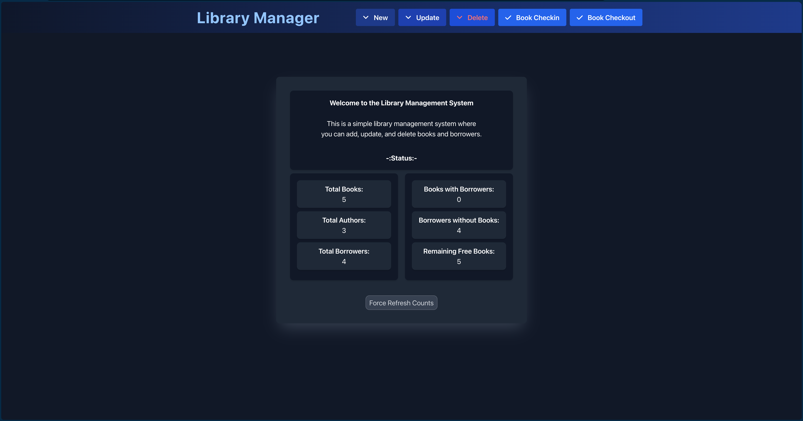

# Simple Library Management System
- user can add, delete, update books
- user can add, delete, update borrowers
- user can add, update authors
- user can borrow books
- user can return books

# Views:
- Home

- Add
    - Add Book
    - Add Borrower
    - Add Author
- Update
    - Update Book
    - Update Borrower
    - Update Author
- Delete
    - Delete Book
    - Delete Borrower

- Book Checkin

-Book Checkout